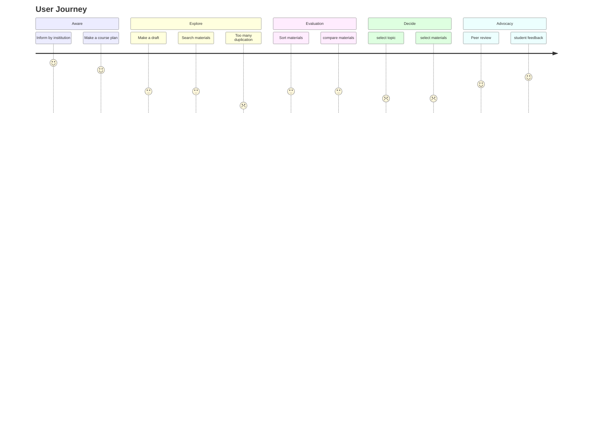

# UX|UI Case Study: WIKIMEDIA CH Data Science Challenge for openedu.ch

#### Empowering Knowledge — An open source educational platform for educators

## Summary

Usability, user experience and value proposition are the main objectives we want to solve within the project timeline. In this document, User Experience and User Interface are addressed based on a series of analyses, from investigating initial problems to be solved to delivering an interactive visual prototype that aligns with technical solutions and user goals. 

This document is submitted as part of the deliverable for the WIKIMEDIA.CH data science project challenge for OPENEDU.CH.

Full Project documentation and code can be seen on [OpeneduC - GitHub](https://github.com/WomenPlusPlus/deploy-impact-22-openedu-c)

## Overview

### About OPENEDU.CH

**OPENEDU.CH** s an open education resource platform launched in 2020 by the WIKIMEDIA CH organization. advocates fair education, and encourages educators to connect, collaborate and share knowledge through this platform. Through this platform, educators can benefit from accessing educational rescore on any topic, anywhere, in addition,  OPENEDU.CH also provides training services and tools upon request. To achieve a business goal, and build such a platform, a strategic business analysis and data-driven approach are needed.

### The Process

To achieve the business goal, the Double Diamond Process Model is applied as this model is not only focused on design elements but taking a holistic view to design a system that can be run technically and visually. The Double Diamond Process Model consists of four phases as follows:

- **Discover:** 
  - Understand what is ontology; who are the key stakeholders, and how they will be affected by the ontology.
  - Reverse the existing database structure, and design, function, and service that offer on the current website
- **Define:** 
  - Gathering insights from all team members and defining the domain and purpose of ontology and formulating the structure of the database
  - Identify key problems that need to be addressed now. we decided to focus on optimizing searching, filtering and uploading functions.
- **Develop:** Once we define our key problems, and common goal, we divided tasks based on member's expertise, which are **Database**, **Data science** and **UX|UI**, and each member can focus on developing solutions
- **Delivery:** we proposed three actionable solutions which are implemented within six weeks
  - Refine ontology, data model and data pipeline
  - Search engine optimization with NLP approach
  - Visual Prototype: redesign landing page, result search page and upload form

## Discover

### Assessment

After discussing the business goal and main requirement with the PO, we first reversed the existing website based on four criteria: design, structure, functionality and value proposition to identify initial problems.

**current website**

The current website adapted a simply design, nevertheless it is unclear who are the main audience while for visitor to understand what service or products the website offers or what benefits visitor will get through the website. 

The three main categories that were evaluated were value proposition, usability, and user experience. Initial issues and corresponding improvements are described in the table below.

| Category              | Problems                                                     | Improvement                                                  |
| --------------------- | ------------------------------------------------------------ | ------------------------------------------------------------ |
| **Value Proposition** | **Logo**: there are two logos, one is Wikipedia and one is openedu  **Message:** Unclear message and target users | 1. One logo  2. Develop content strategy that follow **5-W-Method** |
| **Usability**         | **Filters**: filters such as topics and category have similar meaning, can confuse users  **Search UI**: not working  **Output result:** user expects to see content of the search result instead of a link to other projects | 1. Remove overlapped filters, and refine the subcategory in each filter  2. Refine data modelling and relationship of the existing database. |
| **User Experience**   | **Visual**: message overloading on the heading section, too many texts, colours, and blocks  for instance: a three column cards distract users attentions  **Animation**: a quote block underneath the navigation bar is animated which irritate users to focus on tasks they intend to do on this website  **Functionality:** the filter function does not narrow down the output result but generate more contents  **Search result:** inconsistent output result (card) makes users hard to read through the content | 1. Eliminate texts and blocks and create sections layout to deeply information  2. remove redundant design  3. Apply design principle to optimize user experience  4. Prioritize and improve important features: navigation, search UI, Hero section and CTA |

### Competivie analysis

**Open Education Resource(OER)**:Medium, Google Scholar, MIT, Oercommons, BC campus and Europeana are chosen for benchmarking due to the platform type, content, and service they offer are very alike to OPENEDU.CH. Based on these five main criteria: information architecture, navigation, search function, filters and search results, we can further refine the OPENEDU Website.

### Persona

In addition, we also create 2 personas to get a better understanding how what OPENEDU.CH's users probably look like and be able to come up with better solutions to tackle their problems

### **User Jounrey**

A user journey includes needs recognition, exploration, evaluation, decision making and post behaviour. The diagram map out critical touchpoints, actions and emotion of the target personas

### User Interview

After completing the above analysis, key findings are extracted and formed five key subjects that we would like to further investigate through user interviews. The subjects are:

1. **The context**: In what situation educators would visit an educational resource platform

2. **Behaviour**: What do educators look for when visiting educational resource platforms

3. **Motivation**: What is the motivation for using an educational resource platform

4. **Expectation**: What product/ service do you expect to see on an educational resource platform

5. **User Engagement**: What is the motivation for engaging with other users on an educational resource platform

These five questions are further elaborated into eight subquestions. To improve the usability and user experience of the current site, user testing was also given at the end of the interview.

| Topic                                                        | Subject                                  |                                                              |
| ------------------------------------------------------------ | ---------------------------------------- | ------------------------------------------------------------ |
| **Usage of the educational platform**                        | **Context** **Motivation**          | When you go to the educational platform, what was your goal/task that makes you visit these sites? |
|                                                              | **Expectation** **User Engagement** | What functions help you to complete your tasks               |
|                                                              | **Expectation**                          | What struggle you during the process, and what can help you to complete your tasks |
| **Uploading / sharing your work on an educational platform** | **Context** **Motivation**          | How much time would you like to invest in the uploading process including registering as a user and filling out an information sheet? |
|                                                              | **Behaviour** **Expectation**       | IF you have uploaded files on an educational platform (or any platform), what struggle did you have during the process, and what can help you to complete your tasks? |
| **Collaboration & networking on an educational platform**    | **Motivation** **User Engagement**  | What would motivate you to sign up as a member of an educational platform? |
|                                                              | **Expectation** **User Engagement** | What would you expect this platform can offer you?           |
|                                                              | **Motivation** **User Engagement**  | How would you like to interact with other educators?         |

We conducted user interviews with 5 potential users (one internal and 4 external users.

- 90 % of the Users search bar to start their search on the majority platform
- Online Community, Peer review and students feedback are critical touchpoints
- Having clear instructions and guidance would help the user to complete the uploading process
- Users wish to get in touch with other teachers and connect in a simple, easy way

## Define

We collected ideas from team brainstorming, user interview and competitive analysis, and we finally selected the most prominent features which are: **Search UI**, **Filters**, **Uploading Form**, and **Redesign Landing page** that is aligned with solutions from our technical team, and be able to visualize in the final prototype

## Develop

At this stage, we compared potential solutions and selected the most reasonable ideas to develop and listed in the table below:

| Features                 | Actions                                                      | Impact                                                       | Technique                                               |
| ------------------------ | ------------------------------------------------------------ | ------------------------------------------------------------ | ------------------------------------------------------- |
| **Search bar**           | 1.Enlarge and ceterned this feature in the landing page  2.Implement autocomplete function for key word search | Visible search UI especially on website with heavy information can help user to find content easily | A dummy UI intergrated with NLP,  semetic search        |
| **Filters**              | 1.Rename unclear or confuse filters 2.Remove overladped filters 3. Applied dropdown function on the filters 4. Applied Use vertical filters section help user to prioritize tasks they wish to do on the site | Eliminate uncertainty and confusion that can deter users motivation to use the website | Update the current database and adjsut  database schema |
| **Uploading Form**       | 1. Reduce user effort in the input fileds 2. Simplify uploading process with an indication and procedure 3. Tooltips | Reduce the obstacle and potential drop out during the process | UI only                                                 |
| **Website Landing page** | 1. Reduce information overload 2. Create **a clear message**: how people who you are, what do you do and what offers they can expect when visiting the website 3.Highlight **Call-to-Action** button to encourage users engagement | Building trust and connection users                          | UI only                                                 |

### User Flow

After we define the key features, I designed the user flow of the search and file uploading process.

## Prototype

In the design phase, we implemented the Mental model and design principle to reduce the cognitive loading on the web page by optimizing users' pleasant experiences that can help them easily navigate the website.

### **Mental Model**

A mental model is a sort of thinking system in our brains. It guides people to react and interact with something based on what people see and what they believe in their thinking system. Users expect what they believe and will interact with a product and service they have experienced before. Therefore, making the website similar to its competitor can help users easily navigate the site without hesitating.

### UI Redesign

- **Landing page**
  - Landing page
  - Core message: a short and powerful slogan tell users Who we are, what we do and what service and products offer on this site
  - Enlarge Search UI: make the search bar visible
  - CTA button: invite people to sign up and explore the site
  - visiable navigation: make the navigation visible to users without opening the hamburger menu 

- **Resource page: Use Dropdown animation in the filter feature**

  

- **Sign up pages**

On the sign-up page, we want to collect more user basic information, not just their name and email. However, to make the user feel comfortable and share their information with us, we implemented some tags and a drop-down menu to help users to fill out their information in a simple way. 

- **Uploading Pages**

We make the uploading form simpler and divide the process into four steps, to make the user informed and know which section they are in and be able to estimate how much time they need to complete this task.

### Result: Interactive Website Prototype 

A landing page and resource page are created in Figma. In addition, three interactive features can be tested in this website prototype:

1. **Search bar**: try to entry "**scie**" and select **science competetion** then press **enter** to see the output search result 
2. **Filters**: a list of dropdown menu allow users to interacte with
3. **Sign up and uploading form**: you can access sign up page by click the sign up button, it will guide you through the sign up and add file processes

[Figma Interactive Prototype](https://www.figma.com/proto/gRaDjSdaGjpapaVguTvRux/OpenEdu?page-id=0%3A1&node-id=5%3A22&viewport=247%2C220%2C0.06&scaling=min-zoom&starting-point-node-id=5%3A22)

## Go to the Market

Now that we had achieved the outcome. Our team also prepared a pitch desk to support the launch of these exciting features that we have developed over the past six weeks. The presnetation can be see in [Canva](https://www.canva.com/design/DAFRclqQvVc/WA8bONken9AouR8n8UpdqQ/view?utm_content=DAFRclqQvVc&utm_campaign=designshare&utm_medium=link&utm_source=publishsharelink)

## Reflection

The purpose of this project is to provide tangible and actionable solutions for the client. Although the redesigned website was not required by OpenEdu.ch, we believe having a website prototype that can visualize our solution feasibly is more convincing when pitching our idea. There are still some improvements that need to be addressed accordingly based on the data collection in future development.
